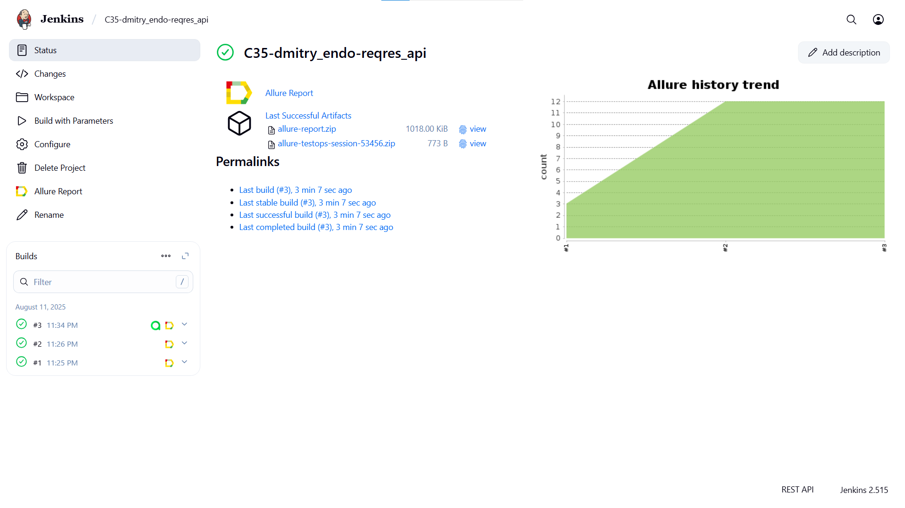
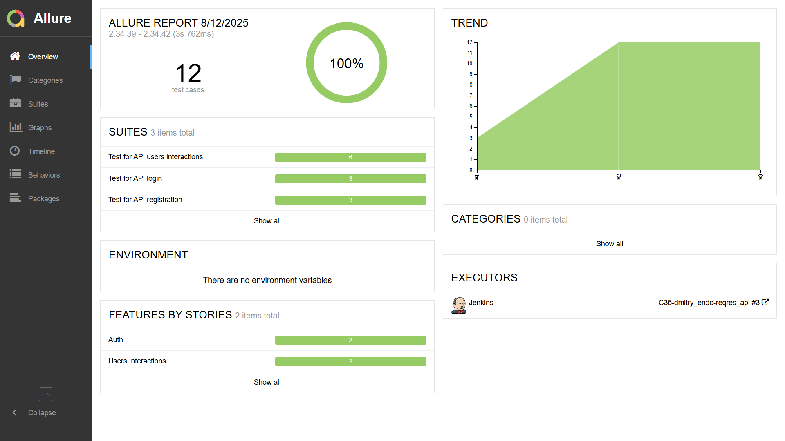
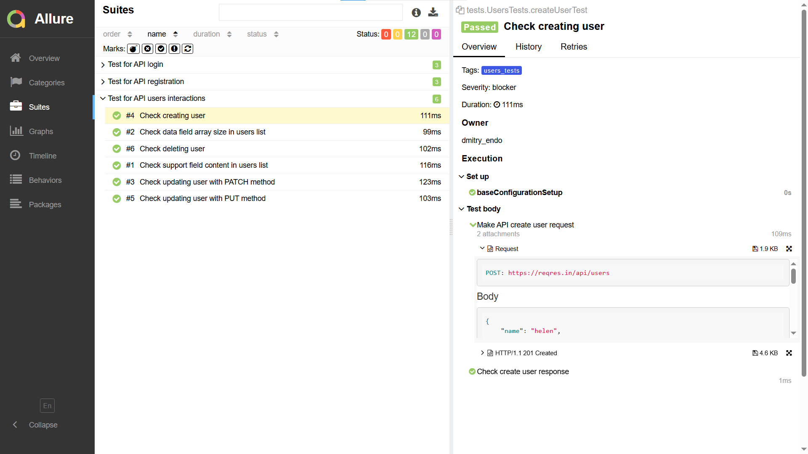
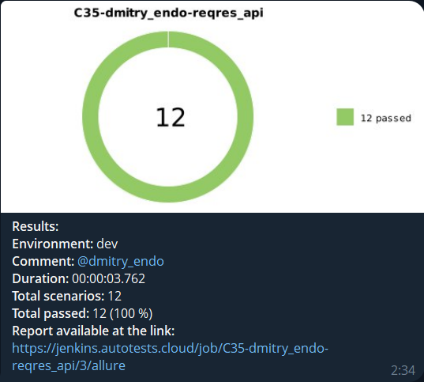
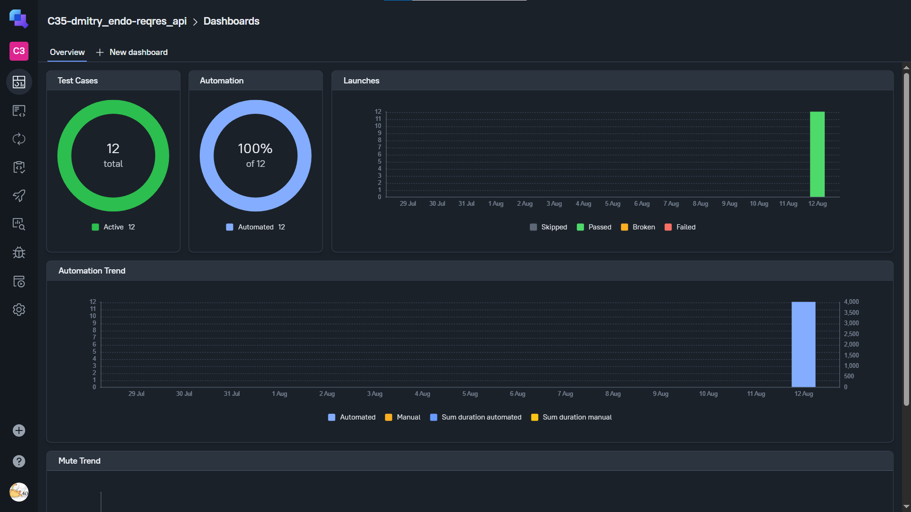
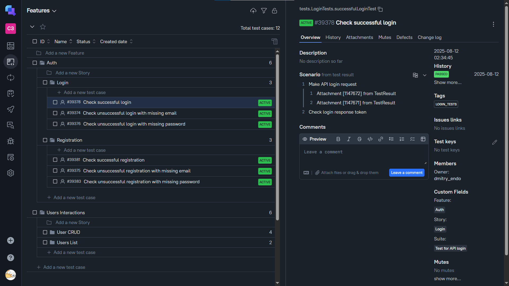

<p align="center">
  <a href="https://t-j.ru/" target="_blank">
    
  </a>
</p>


# Проект по автоматизации тестирования для сайта [Т-Ж](https://t-j.ru/)


## **Содержание:**
____

* <a href="#tools">Технологии и инструменты</a>

* <a href="#cases">Примеры автоматизированных тест-кейсов</a>

* <a href="#jenkins">Сборка в Jenkins</a>

* <a href="#console">Команда для запуска из терминала</a>

* <a href="#allure">Allure отчет</a>

* <a href="#telegram">Уведомление в Telegram при помощи бота</a>

* <a href="#integrations">Интеграция с Allure TestOps</a>


____
<a id="tools"></a>
## <a name="Технологии и инструменты">**Технологии и инструменты:**</a>


<p align="center">  
<a href="https://www.jetbrains.com/idea/"></a>  
<a href="https://www.java.com/"></a>  
<a href="https://github.com/"></a>  
<a href="https://junit.org/junit5/"></a>  
<a href="https://gradle.org/"></a>  
<a href="https://rest-assured.io/"></a>  
<a href="https://www.jenkins.io/"></a>  
<a href="ht[images](images)tps://github.com/allure-framework/allure2"></a>
<a href="https://qameta.io/"></a>
</p>

- Автотесты написаны в <code>IntelliJ IDEA</code> на языке <code>Java</code> c помощью фреймворков <code>REST-Assured</code> и <code>JUnit 5</code>.
- При сборке проекта используется <code>Gradle</code>.
- Для удаленного запуска реализована джоба в <code>Jenkins</code> с формированием Allure-отчета и автоматической отправкой результатов в <code>Telegram</code> (при помощи бота).
- Реализована интеграция с <code>Allure TestOps</code>.


____
<a id="cases"></a>
## <a name="Примеры автоматизированных тест-кейсов">**Примеры автоматизированных тест-кейсов:**</a>
____
✓ *Проверка новостной ленты на главной странице*  
✓ *Проверка появления модального окна входа в профиль*  
✓ *Проверка названия и количества основных вкладок навигации в хедере*  
✓ *Проверка появления окошка с уведомлениями*  
✓ *Проверка появления и размера меню с предлагаемыми запросами после нажатия на поиск*  
✓ *Проверка основных категорий на странице Потоки*  
✓ *Проверка количества категорий на странице Потоки*  
✓ *Проверка успешного поискового запроса*  
✓ *Проверка неуспешного поискового запроса*


____
<a id="jenkins"></a>
## </a><a name="Сборка"></a> Сборка в [Jenkins](https://jenkins.autotests.cloud/job/C35-dmitry_endo-reqres_api/)</a>
____
<p align="center">  
  
</p>


<a id="console"></a>
## Команда для запуска из терминала
___
```bash  
gradle clean test
```


___
<a id="allure"></a>
## </a> <a name="Allure"></a> Allure [отчет](https://jenkins.autotests.cloud/job/C35-dmitry_endo-tinkoff_journal_ui/12/allure/)</a>
___

### *Основная страница отчёта*

<p align="center">  
  
</p>  

**Тест-кейсы** содержат в себе:
- Шаги
- Request
- Response

<p align="center">  
  
</p>


____
<a id="telegram"></a>
## </a> Уведомление в Telegram при помощи бота
____
После завершения тестов: Telegram-бот отправляет уведомление с результатами и статистикой.
<p align="center">  
  
</p>


____
<a id="integrations"></a>
## </a> <a name="Интеграция с Allure TestOps"></a>Интеграция с [Allure TestOps](https://allure.autotests.cloud/project/4879/dashboards)</a>
___

### *Основные страницы*

<p align="center">  
  
</p>  

<p align="center">  
  
</p>

____